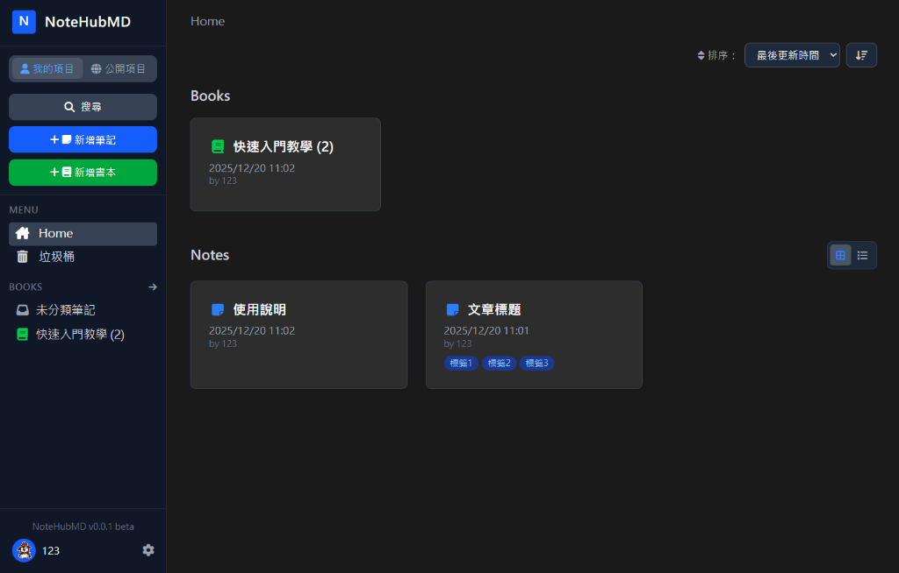
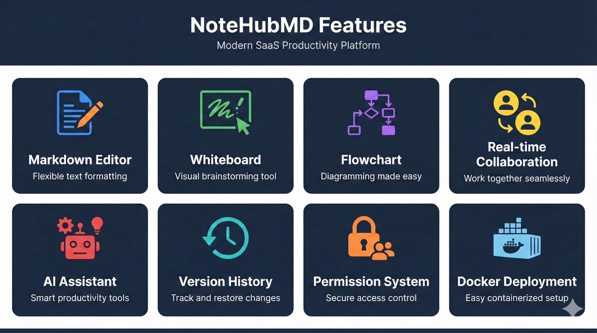

# NoteHubMD

[繁體中文](README.md)

A modern, self-hosted Markdown note-taking platform with real-time collaboration.



## ✨ Features



- **📝 Markdown Editor** - Full-featured editor with live preview, syntax highlighting, and Mermaid diagram support
- **🎨 Whiteboard** - Excalidraw-based whiteboard with real-time multi-user collaboration via Yjs CRDT
- **📊 Flowchart** - Draw.io integration with real-time collaboration
- **👥 Real-time Collaboration** - Multiple users can edit the same note simultaneously via Socket.IO
- **📚 Books & Notes** - Organize your notes into books with drag-and-drop reordering. Supports Grid/List views.
- **🔐 Permission System** - Granular access control (private, public, login-required, per-user permissions)
- **🔗 Custom Share URLs** - Create memorable aliases for shared notes (e.g., `/s/my-tutorial`) and books.
- **💬 Comments** - Enable discussions on notes with threaded comments and emoji reactions
- **😊 Emoji Reactions** - React to notes and comments with emojis
- **🔄 Version history** - Version control for notes with diff view and restore capability.
- **🤖 AI Assistant** - Integrated AI chat with OpenAI-compatible API and local Ollama support
- **🔔 Comment Webhook** - Send notifications to external services when new comments are posted
- **🏢 LDAP/AD Integration** - Enterprise-ready with Active Directory authentication
- **🐳 Docker Ready** - Easy deployment with Docker Compose
- **🗄️ Database Options** - PostgreSQL (recommended) or SQLite

## 🚀 Quick Start with Docker

### Prerequisites
- Docker and Docker Compose installed

### Installation

1. Clone the repository:
```bash
git clone https://github.com/Jia35/notehubmd.git
cd notehubmd
```

2. Start the services:
```bash
docker-compose up -d
```

3. Access the application at `http://localhost:3000`

### Development

The project is now structured as a monorepo with `backend` and `frontend` directories.

1. Install dependencies:
```bash
npm run install:all
```

2. Start development servers:
```bash
# Terminal 1: Backend (Port 3000)
npm run dev:backend

# Terminal 2: Frontend (Port 5173)
npm run dev:frontend
```
Access the application at `http://localhost:5173`.

3. Production Build:
```bash
# Build frontend
npm run build:frontend

# Start backend serving static files
npm start
```

### Configuration

Create a `.env` file in the project root to customize settings:

```bash
cp .env.example .env
```

## ⚙️ Environment Variables

| Variable | Description | Default |
| --- | --- | --- |
| `PORT` | Server port | `3000` |
| `USE_VITE_BUILD` | Serve Vite build from `frontend/dist` | `false` |
| `SESSION_SECRET` | Session encryption key (change in production!) | `your-secret-key-here` |
| **Database** | | |
| `DB_DIALECT` | Database type (`postgres` or `sqlite`) | `postgres` |
| `DB_HOST` | Database host | `localhost` |
| `DB_PORT` | Database port | `5432` |
| `DB_USERNAME` | Database username | `postgres` |
| `DB_PASSWORD` | Database password | - |
| `DB_NAME` | Database name | `notehubmd` |
| `DB_STORAGE` | SQLite file path (when using SQLite) | `./database/database.sqlite` |
| **Permissions** | | |
| `DEFAULT_NOTE_PERMISSION` | Default permission for new notes | `private` |
| `DEFAULT_BOOK_PERMISSION` | Default permission for new books | `private` |
| **Features** | | |
| `FEATURE_COMMENTS` | Enable comments feature | `true` |
| `FEATURE_NOTE_REACTIONS` | Enable note emoji reactions | `true` |
| `DRAWIO_URL` | Draw.io instance URL (public or self-hosted) | `https://embed.diagrams.net` |
| `API_MASTER_KEY` | Master API key for external access | - |
| **Webhook** | | |
| `COMMENT_WEBHOOK_URL` | URL to send comment notifications | - |
| **Trash** | | |
| `TRASH_AUTO_DELETE_DAYS` | Auto-delete trash after X days (0 to disable) | `90` |
| **LDAP (Optional)** | | |
| `LDAP_ENABLED` | Enable LDAP authentication | `false` |
| `LDAP_URL` | LDAP server URL | - |
| `LDAP_BIND_DN` | LDAP bind DN | - |
| `LDAP_BIND_PASSWORD` | LDAP bind password | - |
| `LDAP_SEARCH_BASE` | LDAP user search base | - |
| `LDAP_SEARCH_FILTER` | LDAP search filter | `(sAMAccountName={{username}})` |
| **Proxy (Optional)** | | |
| `HTTP_PROXY` | HTTP proxy server URL | - |
| `HTTPS_PROXY` | HTTPS proxy server URL | - |
| `NO_PROXY` | Hosts to bypass proxy | - |

## 🔔 Comment Webhook

When `COMMENT_WEBHOOK_URL` is configured, the system will send a POST request whenever a new comment is created.

### Request Format

```json
{
  "event": "comment.created",
  "timestamp": "2026-01-10T10:30:00.000Z",
  "note": {
    "id": "abc123",
    "title": "Note Title",
    "type": "markdown",
    "shareUrl": "http://localhost:3000/s/xyz789",
    "owner": {
      "id": 1,
      "username": "creator",
      "name": "Creator Name"
    },
    "lastEditor": {
      "id": 2,
      "username": "editor",
      "name": "Editor Name"
    }
  },
  "comment": {
    "id": 100,
    "content": "Comment content",
    "createdAt": "2026-01-10T10:30:00.000Z",
    "user": {
      "id": 3,
      "username": "commenter",
      "name": "Commenter Name"
    }
  },
  "parent": {
    "id": 99,
    "content": "Parent comment content",
    "createdAt": "2026-01-10T10:00:00.000Z",
    "user": {
      "id": 2,
      "username": "parent_user",
      "name": "Parent User Name"
    }
  }
}
```

> **Note**: The `parent` field is only included when replying to an existing comment.

## 🤖 AI Assistant

AI Assistant is configured through the admin panel and supports:
- AI chat functionality on note pages
- OpenAI-compatible API and local Ollama support
- Customizable system prompts and suggested questions

### Configuration

1. Log in as an administrator
2. Go to "Settings" → "Admin" → "AI Assistant Settings"
3. Enable AI and configure the API settings

### Proxy Support

To connect to AI services through a proxy server, set the environment variables:

```bash
HTTP_PROXY=http://proxy.example.com:8080
HTTPS_PROXY=http://proxy.example.com:8080
NO_PROXY=localhost,127.0.0.1
```

## 📄 License

MIT License
