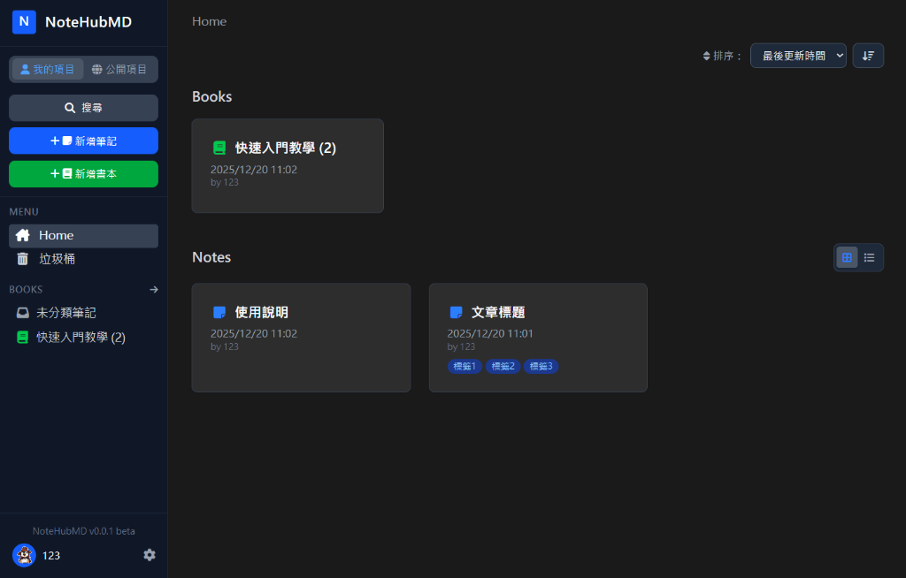

# NoteHubMD

現代化、可自架的 Markdown 筆記平台，支援即時協作。



## ✨ 功能亮點


- **📝 Markdown 編輯器** - 完整功能的編輯器，支援即時預覽、語法高亮、Mermaid 流程圖
- **👥 即時協作** - 透過 Socket.IO 實現多人同時編輯同一份筆記
- **📚 書本與筆記** - 使用書本分類筆記，支援拖曳排序
- **🔐 權限系統** - 細緻的存取控制（私人、公開、需登入、個別使用者權限）
- **🔗 自訂分享網址** - 為分享的筆記建立容易記憶的別名（例如 `/s/my-tutorial`）
- **💬 留言功能** - 在筆記上啟用討論與留言
- **🏢 LDAP/AD 整合** - 支援 Active Directory 企業級驗證
- **🐳 Docker 部署** - 使用 Docker Compose 輕鬆部署
- **🗄️ 資料庫選項** - 支援 PostgreSQL（建議）或 SQLite

## 🚀 使用 Docker 快速開始

### 前置需求
- 已安裝 Docker 和 Docker Compose

### 安裝步驟

1. 複製專案：
```bash
git clone https://github.com/your-username/notehubmd.git
cd notehubmd
```

2. 啟動服務：
```bash
cd docker
docker-compose up -d
```

3. 開啟瀏覽器訪問 `http://localhost:3000`

### 開發指南

1. 安裝依賴套件：
```bash
npm install
cd client && npm install
```

2. 啟動開發伺服器：
```bash
# 終端機 1：後端
npm start

# 終端機 2：前端 (Vite)
npm run client:dev
```
開發時請訪問 `http://localhost:5173`。

3. 生產環境建置：
```bash
npm run client:build
# 使用 Vite 建置檔啟動伺服器
export USE_VITE_BUILD=true
npm start
```

### 自訂設定

在專案根目錄建立 `.env` 檔案來自訂設定：

```bash
cp .env.example .env
```

## ⚙️ 環境變數

| 變數                      | 說明                                     | 預設值                          |
| ------------------------- | ---------------------------------------- | ------------------------------- |
| `PORT`                    | 伺服器埠號                               | `3000`                          |
| `USE_VITE_BUILD`          | 是否使用 `public_dist` 的 Vite 建置檔案  | `false`                         |
| `SESSION_SECRET`          | Session 加密金鑰（正式環境請務必修改！） | `your-secret-key-here`          |
| **資料庫**                |                                          |                                 |
| `DB_DIALECT`              | 資料庫類型（`postgres` 或 `sqlite`）     | `postgres`                      |
| `DB_HOST`                 | 資料庫主機                               | `localhost`                     |
| `DB_PORT`                 | 資料庫埠號                               | `5432`                          |
| `DB_USERNAME`             | 資料庫使用者名稱                         | `postgres`                      |
| `DB_PASSWORD`             | 資料庫密碼                               | -                               |
| `DB_NAME`                 | 資料庫名稱                               | `notehubmd`                     |
| `DB_STORAGE`              | SQLite 檔案路徑（使用 SQLite 時）        | `./database/database.sqlite`    |
| **權限**                  |                                          |                                 |
| `DEFAULT_NOTE_PERMISSION` | 新筆記的預設權限                         | `private`                       |
| `DEFAULT_BOOK_PERMISSION` | 新書本的預設權限                         | `private`                       |
| **功能**                  |                                          |                                 |
| `FEATURE_COMMENTS`        | 啟用留言功能                             | `true`                          |
| `API_MASTER_KEY`          | 外部存取用的 Master API Key              | -                               |
| **LDAP（選用）**          |                                          |                                 |
| `LDAP_ENABLED`            | 啟用 LDAP 驗證                           | `false`                         |
| `LDAP_URL`                | LDAP 伺服器 URL                          | -                               |
| `LDAP_BIND_DN`            | LDAP Bind DN                             | -                               |
| `LDAP_BIND_PASSWORD`      | LDAP Bind 密碼                           | -                               |
| `LDAP_SEARCH_BASE`        | LDAP 使用者搜尋 Base                     | -                               |
| `LDAP_SEARCH_FILTER`      | LDAP 搜尋過濾器                          | `(sAMAccountName={{username}})` |

## 📄 授權

MIT License
