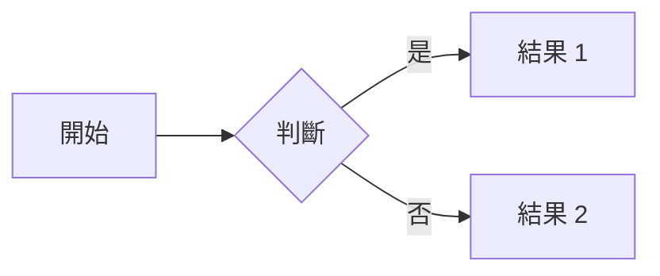

# Markdown 語法說明

Markdown 是一種輕量級的標記語言，讓您可以使用純文字格式撰寫文件。

:::info
可透過右上方「編輯」按鈕前往編輯頁面，查看原始 Markdown 語法如何撰寫。
:::

## 基本語法

### 標題

```markdown
# 標題 1
## 標題 2
### 標題 3
```

### 文字格式

**粗體文字**
*斜體文字*
~~刪除線~~
==標記文字==
上標：10^th^
下標：H~2~O

### 分隔線

---
***

<br>

## 清單

### 無序清單

- 項目 1
- 項目 2
  - 子項目

也可以用 * 字號：

* 項目 1
  * 子項目 1-1
    * 子項目 1-1-1

### 有序清單

1. 有序項目 1
2. 有序項目 2

渲染會自動按照順序編號：

50. 從 50 開始
50. 後面編號隨便打也沒關係
99. 後面編號隨便打也沒關係

### 待辦事項

- [ ] 未完成事項
- [x] 已完成事項

<br>

## 連結與圖片

### 連結

[連結文字](https://www.google.com/)

### 圖片


指定圖片大小 (尺寸:單位px = width x height)：


指定圖片大小 (長寬比:單位% = width x height)：


\* 留空等於等比例

<br>

## 表格

| 欄位 1 | 欄位 2 | 欄位 3 |
|--------|--------|--------|
| 資料 1 | 資料 2 | 資料 3 |

也可以指定對齊方式：

| 靠左對齊      | 靠右對齊     | 置中對齊      |
| :----------- | ----------: | :----------: |
| 資料 1        | 資料 2      | 資料 3        |
| 一段較長的文字 | 一段較長的文字 | 一段較長的文字 |

<br>

## 區塊

### 程式碼

行內程式碼：`code`

程式碼區塊：

```
function hello() {
    console.log('Hello, World!');
}
```

加上行數 (使用`=`)：

```=
function hello() {
    console.log('Hello, World!');
}
```

指定開始行號：

```=100
function hello() {
    console.log('Hello, World!');
}
```

也可以指定程式語言(會有高亮效果)：

```javascript=
function hello() {
    console.log('Hello, World!');
}
```

太長可強迫換行 (使用`!`)：

```
NoteHubMD 是一個基於 Markdown 的協作筆記平台，讓您可以輕鬆地撰寫、分享和組織您的筆記。主要功能有 Markdown 編輯器、書本組織、分享功能、多人協作編輯...
```

```!
NoteHubMD 是一個基於 Markdown 的協作筆記平台，讓您可以輕鬆地撰寫、分享和組織您的筆記。主要功能有 Markdown 編輯器、書本組織、分享功能、多人協作編輯...
```

### 引用

> 這是一段引用文字

可以改變前方線條顏色

> 一段引用文字
> 設定強調顏色 (使用**名稱**)
> [color=red]

> 一段引用文字
> 設定強調顏色 (使用**色碼**)
> [color=#148BBA]

### 強調色塊

::: info
這是 info 訊息 :mega:
:::

::: success
這是 success 訊息 :mega:
:::

::: warning
這是 warning 訊息 :mega:
:::

::: danger
這是 danger 訊息 :mega:
:::

### 摺疊區塊

::: spoiler 點選顯示更多內容
找到我了！ :stuck_out_tongue_winking_eye:
:::

### 分頁區塊

::: tabs
@tab:active 分頁一
分頁一的內容

@tab 分頁二
分頁二的內容
:::

<br>

## 進階功能

### 註腳

註腳用於幫筆記內容作補充或加上參考說明，但又不會干擾主文的閱讀。使用 `[^1]` 可以是數字或字串，而且會自動依連結參照出現的順序編號。

註腳 1 連結[^1]。
註腳 2 連結[^second]。
行內註腳^[行內註腳的文字] 定義。
重複的註腳參考[^second]。

[^1]: 註腳 **也支援 Markdown 語法**
    還可以有很多段落
[^second]: 註腳文字後面也有反向連結

### 縮寫

有些專有名詞可標示全名或解釋 (`使用 *[專有名詞]`)，滑鼠指到它會顯示，方便讀者理解。

例如 HTML 的縮寫範例，它會轉換 "HTML"，但是縮寫旁邊其他的部分，例如："xxxHTMLyyy"，不受影響。

*[HTML]: Hyper Text Markup Language

### Mermaid 圖表



### 數學公式 (LaTeX 語法，透過 KaTeX 套件)

方便的 [線上數學式編輯器](https://latexeditor.lagrida.com/)。

行內的前後使用 `$` 包圍：$E = mc^2$

想要區塊呈現就用 `$$` 包圍：
$$ \int_a^b f(x) dx $$

使用 `$$` 內可換行撰寫：

$$
\left\{
  \begin{array}{c}
    a_1x+b_1y+c_1z=d_1 \\
    a_2x+b_2y+c_2z=d_2 \\
    a_3x+b_3y+c_3z=d_3
  \end{array}
\right.
$$
